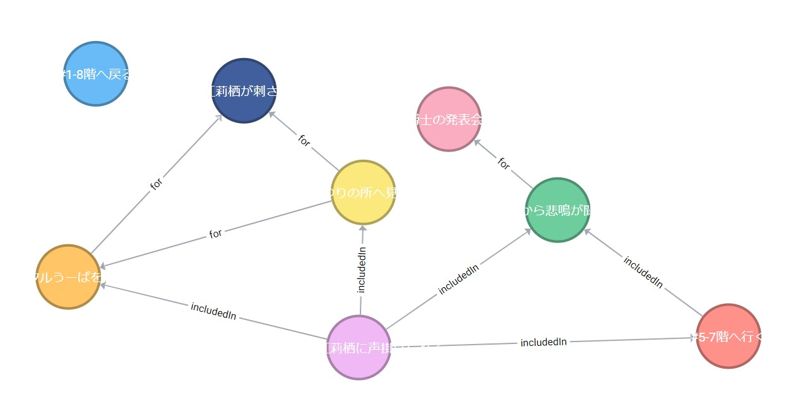

# Linked Data Graphic

Linked Data Graphic and Visualization Components for Angular



## Quick Usage

```html
<chigix-ld-graphic [data]="ldData"></chigix-ld-graphic>
```

## Build

Run `npm run build-release` to build the component library.
The build artifacts will be stored in the `dist/` directory.

## Running unit tests

Run `npm run test` to execute the unit tests via [Karma](https://karma-runner.github.io).

## Running end-to-end tests

Run `npm run e2e` to execute the end-to-end tests via [Protractor](http://www.protractortest.org/).
